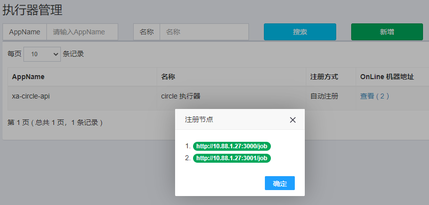
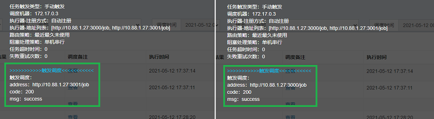

# A Node.js simple implementation of xxl job executor

### 添加组件依赖

```shell
git clone https://github.com/Aouchinx/xxl-job-executor-nodejs.git your_path
```

`package.json`

```json
{
  "dependencies": {
    "xxl-job-executor-nodejs": "your_path/xxl-job-executor-nodejs"
  }
}
```

### 使用组件

```javascript
const { applyXxlJobMiddleware } = require('xxl-job-executor-nodejs')
applyXxlJobMiddleware(app, appType, executorUri, executorUrl, executorKey, scheduleCenterUrl, accessToken, jobLogPath, jobHandlers)
```

具体用法参考 `examples/express.js`、`examples/koa.js`

### 注意事项

任务必须被定义成 `promise` 函数，任务的执行日志必须由 `jobLogger` 输出，如：

```javascript
const demoJobHandler = async ({ jobLogger, ...jobParams }) => {
  jobLogger.info('job start, it will takes about 10 seconds')
  const sleep = async (millis) => new Promise((resolve) => setTimeout(resolve, millis))
  await sleep(10000)
  jobLogger.info('job finish')
}
```

### 测试截图
 

