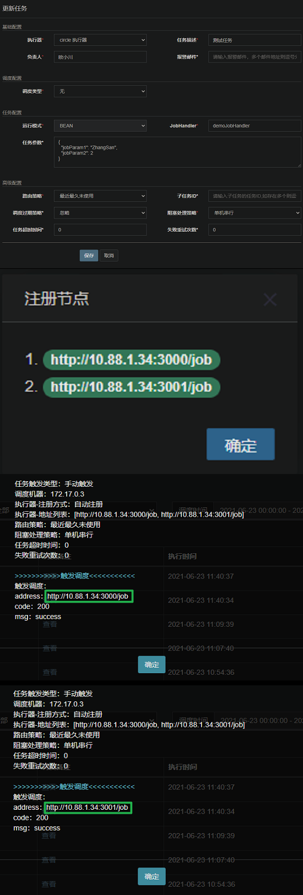

# A Node.js simple implementation of xxl job executor

---

### 添加组件

1. 添加子模块

```shell
git submodule add https://bit.dev.xinfujinan.com/scm/console/xxl-job-executor-nodejs.git modules/xxl-job-executor-nodejs
```

2. 更新子模块

```shell
git submodule init
git submodule update --remote
```

3. 添加组件依赖

```json
{
  "dependencies": {
    "xxl-job-executor-nodejs": "./modules/xxl-job-executor-nodejs"
  }
}
```

---

### 使用组件

1. 定义任务执行函数

```javascript
/**
 * @param {any} jobLogger 由xxl-job组件初始化的logger，任务执行日志通过 jobLogger 记录，可在调度中心查看
 * @param {any} jobParams 任务执行参数(可选)，在调度中心配置定时任务或手动触发任务时设置的执行参数
 * @param {Object} context 任务上下文
 * @return {Promise<void>} 函数必须定义成异步的(返回值是一个 promise)
 */
const demoJobHandler = async (jobLogger, { jobParam1, jobParam2 }, { database }) => {
    jobLogger.info('jobParam1: %o, jobParam2: %o, database: %o, it will takes about 10 seconds', jobParam1, jobParam2, database)
    const sleep = async (millis) => new Promise((resolve) => setTimeout(resolve, millis))
    for (let i = 1; i <= 10; i++) {
      await sleep(1000)
      jobLogger.debug(`${i}s passed`)
    }
  }
```

2. 配置环境变量

```dotenv
# 执行器AppName，在调度中心配置执行器时使用
XXL_JOB_EXECUTOR_KEY=executor-example-express
# 调度中心地址
XXL_JOB_SCHEDULE_CENTER_URL=http://127.0.0.1:8080/xxl-job-admin
# 请求令牌，调度中心和执行器都会进行校验，双方AccessToken匹配才允许通讯
XXL_JOB_ACCESS_TOKEN=9217CF7406F643BEB71CC00731129CC9
# 任务执行日志的存储路径
XXL_JOB_JOB_LOG_PATH=logs/job
# 执行器运行日志开关(非任务执行日志)，默认关闭
XXL_JOB_DEBUG_LOG=true
```

3. 应用组件

```javascript
const XxlJobExecutor = require('xxl-job-executor-nodejs')
const jobHandlers = new Map([ [ 'demoJobHandler', demoJobHandler ] ])
const context = { /*anything*/ }
const xxlJobExecutor = new XxlJobExecutor(jobHandlers, context)
await xxlJobExecutor.applyMiddleware({ app, appType, appDomain, path })
```

具体用法参考 `examples/express.js`、`examples/koa.js` 以及源码中相应的注释。

---

### 测试截图


